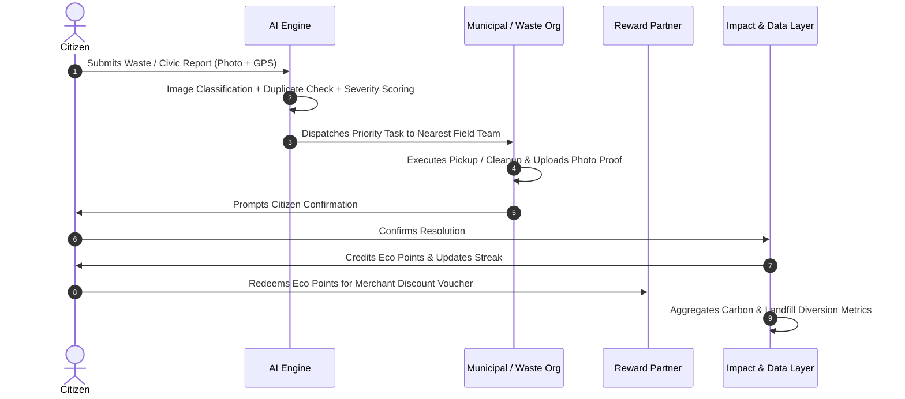
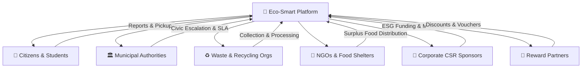

# 🌱 Eco-Smart Platform
### AI-Powered Civic Waste Management & Environmental Intelligence Platform
> **Turning citizen participation into measurable environmental impact.**

<div align="center">

```
  _____ ____ ___        ____  __  __    _    ____ _____ 
 | ____/ ___/ _ \      / ___||  \/  |  / \  |  _ \_   _|
 |  _|| |  | | | |_____\___ \| |\/| | / _ \ | |_) || |  
 | |___| |__| |_| |_____|__) | |  | |/ ___ \|  _ < | |  
 |_____\_____\___/     |____/|_|  |_/_/   \_\_| \_\|_|  
                                                        
  AI • CIVIC INTELLIGENCE • CIRCULAR ECONOMY • WEB3 ESG
```

[](https://opensource.org/licenses/MIT)
[](https://www.openstreetmap.org/copyright)
[](https://nextjs.org/)
[](https://react.dev/)
[](https://www.typescriptlang.org/)
[](https://tailwindcss.com/)
[](https://docs.ethers.org/)
[](https://sdgs.un.org/goals)
[](https://missionlife-moefcc.nic.in/)

[Overview](#-what-is-eco-smart) • [Core Workflow](#-core-workflow) • [System Architecture](#%EF%B8%8F-system-architecture) • [Features](#-key-features) • [Tech Stack](#%EF%B8%8F-technology-stack) • [Roadmap](#%EF%B8%8F-future-roadmap) • [Licenses](#-license--third-party-attributions)

---

</div>

## 🌍 What is Eco-Smart?

**Eco-Smart** is an AI-powered sustainability and civic-management platform designed to connect **citizens, municipalities, waste organizations, environmental datasets, and reward partners** into one cohesive, intelligent ecosystem.

Instead of treating waste management and municipal complaints as disconnected, bureaucratic processes, Eco-Smart creates a **closed-loop execution system**:

```
Citizen ──► Waste / Complaint Report ──► AI Analysis & Prioritization ──► Waste Org / Municipal Execution
                                                                                       │
Continuous Improvement ◄── Impact Analytics ◄── Eco Points ◄── User Confirmation ◄── Action & Photo Proof
```

### 🌟 Key Pillars
* ♻️ **Waste Management**: Smart scheduled pickups, sorting, upcycling, and circular B2B matchmaking.
* 🏙️ **Municipal Complaint Management**: SLA-driven ticket routing with geospatial tracking and verification.
* 🤖 **Artificial Intelligence**: Computer vision waste classification, duplicate detection, and automated priority scoring.
* 📍 **Location Intelligence**: OpenStreetMap GIS mapping, pickup routing, and civic hotspot identification.
* 📊 **Environmental Analytics**: Live carbon offset calculations, landfill diversion tonnage, and resource telemetry.
* 🌫️ **Air Quality Monitoring**: AQI integration mapped against localized waste burning and industrial hotspots.
* 🌍 **Carbon & Impact Tracking**: Verifiable ESG metrics converted from raw physical action into audit-ready data.
* 👥 **Citizen Engagement**: Community social feed, eco-clubs, green events, and upcycling DIY projects.
* 🏆 **Gamification & Eco Points**: Daily sustainability quests, leaderboard tiers, and streak rewards.
* 🎁 **Reward Partnerships**: Redeemable vouchers, café discounts, and sustainable merchant deals.
* 🏢 **Organization Management**: Unified consoles for NGOs, recycling aggregators, and CSR corporate sponsors.
* 📈 **Administrative Analytics**: Real-time city-level SCADA IoT telemetry and resource dispatch heatmaps.

---

## 🚨 The Problem

Environmental problems are often not caused by the absence of solutions—they are caused by **fragmented execution**:

* ❌ **Unresolved Citizen Reports**: Citizens report illegal dumping or leaks, but complaints get buried in bureaucratic silos without status transparency.
* ❌ **Disconnected Waste Lifecycle**: Waste organizations collect materials, but citizens and regulators have zero visibility into whether waste was recycled, repurposed, or dumped in landfills.
* ❌ **Siloed Municipal Data**: Environmental sensor data (AQI, water, power) is scattered across disconnected legacy systems.
* ❌ **Lack of Corporate-Grassroots Bridge**: Corporations have CSR/ESG capital to allocate, but lack verified, grassroots community projects with itemized impact proofs.

```
[ Citizen ]    [ Municipality ]    [ Waste Orgs ]    [ Environmental Data ]    [ Businesses ]    [ Reward Partners ]
     │                │                  │                     │                     │                   │
     └────────────────┴──────────────────┼─────────────────────┴─────────────────────┴───────────────────┘
                                         ▼
                 ⚠️  NO UNIFIED MECHANISM CONNECTING THEM  ⚠️
```

---

## 💡 Our Solution

Eco-Smart acts as a **central intelligence and coordination layer** bridging citizens, municipal authorities, recycling enterprises, and corporate sponsors.

| Layer | Function |
|---|---|
| 👤 **Citizen Layer** | Waste reporting, civic complaints, pickup requests, reward redemption, and personal impact logs. |
| 🤖 **AI Layer** | Computer vision classification, priority scoring, duplicate detection, and smart routing. |
| ♻️ **Waste Layer** | Scheduled collection, categorization, B2B scrap matching, recycling, and verified disposal. |
| 🏙️ **Complaint Layer** | Municipal assignment, SLA dispatch tracking, photo-proof resolution, and citizen sign-off. |
| 🌐 **Data Layer** | Open government data, AQI monitors, census metrics, carbon coefficients, and GIS layers. |
| 📊 **Analytics Layer** | Real-time trend visualizers, civic problem heatmaps, and ESG impact measurement. |
| 🏆 **Engagement Layer** | Gamified tiers, badges, daily sustainability quests, and community social feeds. |
| 🏪 **Reward Layer** | Cryptographically hashed QR vouchers, merchant partnerships, and local business offers. |
| 🏢 **Admin Layer** | Multi-stakeholder governance, IoT telemetry monitoring, data purge tools, and dispatch audits. |

---

## 🔄 Core Workflow



### 1. 👤 Citizen Reports
Citizens can seamlessly:
- Submit waste requests with GPS tagging and high-resolution photo uploads.
- Report municipal grievances (illegal dumping, water leakages, hazardous waste).
- Schedule on-demand scrap/bulk pickups.
- Track resolution status with real-time progress bars.
- Track personal environmental contributions ($CO_2$ saved, waste diverted).
- Earn Eco Points and unlock milestone badges.

### 2. 🤖 AI Analysis Pipeline
The intelligence pipeline automatically processes raw submissions:

```
Raw Submission ──► Image Analysis ──► Classification ──► Location Analysis ──► Duplicate Check ──► Priority Score ──► Team Dispatch
```

- **Material Recognition**: Segregates items into E-Waste, Plastics, Organics, Metals, Glass, and Cardboard.
- **Severity Assessment**: Calculates environmental risk and public health hazard ratings.
- **Duplicate Detection**: Merges multiple citizen reports targeting the same coordinates within a time window.
- **Automated Routing**: Determines nearest collection point and calculates transit distance.

### 3. ♻️ Waste Organization Execution
Acting as the operational execution backbone:
- **Supported Streams**: 🔋 E-Waste, 🍽️ Food Waste, 👕 Textile Waste, 📚 Books, 📄 Paper & Cardboard, 🗑️ Non-Recyclable Waste.
- **Lifecycle Tracking**: `Request` ➔ `Pickup Assignment` ➔ `Collection` ➔ `Sorting` ➔ `Recycle / Upcycle / Dispose` ➔ `Proof of Completion`.

### 4. 🏙️ Municipal Complaint Closed Loop
- Direct integration between citizen tickets and municipal field crews.
- **Verification Guarantee**: Requires geotagged photo proof from workers + final user confirmation before marking status as `RESOLVED`.

### 5. 🎁 Reward Partner Marketplace
- Local cafés, bookstores, zero-waste merchants, and mobility providers offer exclusive discounts in exchange for customer footfall.
- **Win-Win Ecosystem**:
  - *Citizen*: Sustainability efforts turn into tangible financial savings.
  - *Business*: High-intent, eco-conscious customer acquisition.
  - *Platform*: High retention and verified sustainable habits.

### 6. 🌐 External Environmental Data Integration
- **🌫️ AQI Feeds**: Analyzes ambient air quality against localized waste burning trends.
- **🏙️ Census & Demographics**: Maps waste generation volume against population density.
- **🌍 Carbon Coefficient Tables**: Computes accurate greenhouse gas ($CO_2e$) abatement figures.
- **🗺️ OpenStreetMap & Geolocation**: High-accuracy routing, collection zones, and hotspot heatmaps.

---

## 🧠 AI & Analytics Engine

```
┌──────────────┐     ┌──────────────┐     ┌──────────────┐     ┌──────────────┐     ┌──────────────┐
│  Raw Citizen │ ──► │     Data     │ ──► │  AI Vision & │ ──► │   Priority   │ ──► │ Actionable   │
│  Submission  │     │  Validation  │     │ Deduplication│     │   Scoring    │     │ Dispatch     │
└──────────────┘     └──────────────┘     └──────────────┘     └──────────────┘     └──────────────┘
```

### Key Intelligence Capabilities:
* **AI Computer Vision**: Multi-class waste sorting model with confidence scores.
* **Duplicate Detection Algorithm**: Geospatial clustering & perceptual image hashing.
* **Dynamic Priority Scoring**: Weights severity, proximity to water bodies/schools, and aging time.
* **Hotspot Prediction**: Identifies chronic dumping areas before they escalate into health hazards.
* **Front Man AI Copilot**: Natural language conversational assistant for zero-waste guidance, material valuation, and DIY repair instructions.

---

## 📊 Admin Dashboard & Geographic Intelligence

Administrators gain full visibility across urban wards and campus sectors:

```
┌────────────────────────────────────────────────────────────────────────────────────────┐
│  ECO-SMART COMMAND CENTER // GEOGRAPHIC INTELLIGENCE                                   │
├────────────────────────────────────────────────────────────────────────────────────────┤
│  [Total Reports: 1,420]  [Resolved: 1,280]  [Pending: 140]  [Waste Diverted: 48.2 Ton] │
├────────────────────────────────────────────────────────────────────────────────────────┤
│  🗺️ LIVE GIS HOTSPOT MAP                                                               │
│  ┌──────────────────────────────────────────────────────────────────────────────────┐  │
│  │  [🔴 Sector 4: Plastic Overflow]        [🟢 Sector 1: Cleaned & Verified]        │  │
│  │  [🟡 Sector 9: Water Leakage Detected]  [🔵 Sector 2: E-Waste Hub (92% Full)]    │  │
│  │                                                                                  │  │
│  │  AQI Overlay: 🟢 42 (Good) | Grid Energy: 142 kW | Water Flow: 1,200 L/h        │  │
│  └──────────────────────────────────────────────────────────────────────────────────┘  │
└────────────────────────────────────────────────────────────────────────────────────────┘
```

---

## 🏢 Multi-Stakeholder Organization Ecosystem



---

## 🎮 Gamification & Citizen Engagement

Gamification serves as a behavioral catalyst to transform passive citizens into active environmental stewards:

```
Report Waste / Civic Issue ──► Verified Action ──► +100 Eco Points ──► Level Up ──► Unlock Tier Badge ──► Claim Voucher
```

* **Contestant Tiers**:
  * 🥉 *Rookie Contestant* (0 - 499 pts)
  * 🥈 *Eco Vanguard* (500 - 999 pts)
  * 🥇 *Eco Champion* (1,000 - 2,499 pts)
  * 💎 *Grandmaster Guardian* (2,500+ pts)
* **Streak Multipliers**: Daily check-ins, food rescue claims, and DIY upcycling submissions multiply XP.
* **Interactive Minigames**: Engaging on-screen assistants (e.g. *Shinchan Campus Cleanliness Patrol*) for micro-rewards.

---

## 📈 Measurable Environmental Impact

Eco-Smart converts vague environmental claims into **tamper-proof, audit-ready data**:

$$\text{Carbon Offset (kg } CO_2e) = \sum (\text{Material Weight (kg)} \times \text{Emission Factor})$$

* 📉 **Landfill Diversion Rate**: Percentage of waste routed to recyclers vs. municipal dumps.
* ⏱️ **Civic SLA Resolution Time**: Mean time to repair (MTTR) for illegal dump sites and leakages.
* 🍲 **Food Rescued**: Kilograms of edible surplus diverted from methane-producing landfills to community kitchens.
* 📊 **ESG Reporting**: One-click downloadable sustainability reports for CSR sponsors.

---

## 🏗️ System Architecture

```
┌──────────────────────────────────────────────────────────────────────┐
│                            USER PORTAL                               │
│        Waste • Complaints • Nearby Map • Marketplace • Rewards       │
└──────────────────────────────────┬───────────────────────────────────┘
                                   │
┌──────────────────────────────────▼───────────────────────────────────┐
│                         APPLICATION LAYER                            │
│           Next.js 16 • React 19 • App Router • Auth Gateway          │
└──────────────────────────────────┬───────────────────────────────────┘
                                   │
┌──────────────────────────────────▼───────────────────────────────────┐
│                             AI ENGINE                                │
│       Material Vision • Deduplication • Priority Scoring • Copilot   │
└──────────────────────────────────┬───────────────────────────────────┘
                                   │
┌──────────────────────────────────▼───────────────────────────────────┐
│                       ORGANIZATION & CSR HUB                         │
│       Field Work Orders • Fleet Dispatch • Micro-Grants • ESG Reports│
└──────────────────────────────────┬───────────────────────────────────┘
                                   │
┌──────────────────────────────────▼───────────────────────────────────┐
│                       DATA & TELEMETRY LAYER                         │
│       PostgreSQL / Firestore • OpenStreetMap • AQI • IoT SCADA Grid  │
└──────────────────────────────────┬───────────────────────────────────┘
                                   │
┌──────────────────────────────────▼───────────────────────────────────┐
│                         WEB3 SETTLEMENT                              │
│          MetaMask • Ethers.js v6 • Verified Eco-Credits              │
└──────────────────────────────────────────────────────────────────────┘
```

---

## 🚀 Key Features

### 👤 Citizen Portal (`/user`)
* Multi-factor secure authentication with contestant profiles.
* Camera-based AI waste scanning and GPS geolocation capture.
* Real-time ticket lifecycle tracking (`Reported` ➔ `AI Verified` ➔ `Assigned` ➔ `Cleaned`).
* Integrated GIS map for nearest collection kiosks and partner cafés.
* Personal carbon footprint and landfill diversion impact dashboard.

### 🏢 Organization & CSR Portal (`/csr`)
* Campaign sponsorship manager for corporate ESG mandates.
* Direct micro-funding pipeline for student & NGO circular projects.
* Real-time CSR Leaderboard displaying corporate impact rankings.
* Automated generation of verifiable sustainability compliance reports.

### 🏛️ Municipal & Admin Command Suite (`/organization`)
* City-wide incident dispatching with SLA enforcement.
* Real-time SCADA IoT charts for Campus/City power, water leakage, and waste bins.
* Full CRUD management across users, marketplace listings, and food rescue programs.
* Database purging and section cleanup tools.

---

## 🔐 Security & Privacy (Privacy by Design)

Eco-Smart enforces strict security standards:
- 🛡️ **Role-Based Access Control (RBAC)**: Clear segregation between Citizens, Municipalities, NGOs, and Corporate Admins.
- 🔒 **Data Minimization**: Strict collection limits; location data is obfuscated outside active pickup requests.
- 🚫 **No Personal Data Monetization**: Citizen personal records are never sold or exposed for advertising.
- 📜 **Audit Trails**: Immutable logs for complaint resolution and reward distributions.
- 🔑 **End-to-End Encryption**: All transit data secured via TLS 1.3 with JWT authentication headers.

---

## 🛠️ Technology Stack

| Domain | Technology | Description |
|---|---|---|
| **Frontend Framework** | [Next.js 16.3.2](https://nextjs.org/) | React Server Components & App Router |
| **UI Library** | [React 19.2.8](https://react.dev/) | Modern concurrent UI architecture |
| **Language** | [TypeScript 5](https://www.typescriptlang.org/) | Strict end-to-end type safety |
| **Styling** | [Tailwind CSS v4](https://tailwindcss.com/) | High-performance CSS utility system |
| **Animations** | [Framer Motion 12](https://www.framer.com/motion/) | Smooth UI transitions and micro-interactions |
| **Icons & Fonts** | [Lucide React](https://lucide.dev/), Geist | Clean iconography and typography |
| **Data Visuals** | [Recharts 3.10](https://recharts.org/) | Responsive charts for IoT telemetry & metrics |
| **Geospatial / GIS** | [Leaflet 1.9](https://leafletjs.com/), OpenStreetMap | Interactive GIS map and routing |
| **Web3 & Blockchain**| [Ethers.js v6](https://docs.ethers.org/) | MetaMask wallet connector & smart contracts |
| **State Management** | React Context API | Reactive client state with local caching |

---

## 🔌 External Integrations

| Integration | Source / Provider | Purpose |
|---|---|---|
| **Mapping & GIS** | [OpenStreetMap](https://www.openstreetmap.org/) | Hyperlocal map tiles, markers, and routing |
| **Air Quality** | Central Pollution Control Board / OpenAQ | Live AQI feeds and pollution spike alerts |
| **Demographics** | Census of India / Open Data Portal | Waste volume benchmarking by population |
| **Media Storage** | Cloudinary / AWS S3 | Encrypted photo-proof and report uploads |
| **Web3 Wallets** | MetaMask / Browser EIP-1193 | On-chain eco-identity and token verification |
| **Reward APIs** | Local Business Merchant POS | Voucher validation and redemption hooks |

---

## 🗺️ Future Roadmap

```
Phase 1: MVP & Core Workflows (Completed)
  ├── Citizen Portal, Waste Reporting & Civic Complaints
  ├── Basic Eco Points, Rewards Vault & QR Redemption
  └── Role-based routing (/user, /csr, /organization)

Phase 2: Intelligence & Deduplication (Current)
  ├── Computer Vision waste classification
  ├── Geospatial duplicate report clustering
  └── Front Man AI Copilot context-aware handler

Phase 3: Environmental Intelligence
  ├── Live AQI sensor API integration
  ├── IoT LoRaWAN bin fullness telemetry
  └── Predictive waste generation heatmaps

Phase 4: Multi-Stakeholder Ecosystem
  ├── Full B2B scrap procurement marketplace
  ├── Automated NGO food rescue logistics
  └── CSR ESG grant distribution contracts

Phase 5: City-Scale Deployment
  ├── Multi-city municipal dashboards
  ├── ERC-20 $ECO on-chain carbon credit bridge
  └── PWA offline mode with background sync
```

---

## 💰 Sustainability & Business Model

Eco-Smart is built for institutional resilience without compromising user privacy:
1. **CSR Partnerships**: Corporations sponsor clean-up missions and upcycling challenges to meet ESG targets.
2. **Municipal Digitalization**: SaaS model for municipal corporations seeking digital complaint dispatch tools.
3. **Enterprise B2B Recycler Fees**: Commission on large-scale industrial scrap matchmaking via EcoMarket.
4. **Reward Partner Subscriptions**: Local businesses pay modest listing fees for high-visibility sustainable footfall.
5. **Grants**: Green tech & smart city civic research funding.

---

## 🌎 Sustainable Development Goals (SDGs)

Eco-Smart directly advances the following United Nations Sustainable Development Goals:

* 🏙️ **[SDG 11: Sustainable Cities and Communities](https://sdgs.un.org/goals/goal11)**: Reducing adverse per capita urban environmental impact through smart waste systems.
* 🔄 **[SDG 12: Responsible Consumption and Production](https://sdgs.un.org/goals/goal12)**: Halving food waste and substantially increasing circular recycling and upcycling.
* 🌡️ **[SDG 13: Climate Action](https://sdgs.un.org/goals/goal13)**: Mitigating methane from food dumps and lowering carbon footprints through verified diversion.

---

## 🧩 Feasibility & Risk Management

| Dimension | Feasibility Assessment |
|---|---|
| **Technical** | Built on battle-tested web standards (Next.js, TypeScript, OpenStreetMap, REST APIs). |
| **Operational** | Augments existing municipal and NGO workflows without requiring radical infrastructure overhauls. |
| **Financial** | Multi-channel revenue across CSR, enterprise matching, and civic tech innovation grants. |
| **Scalability** | Microservice-ready architecture scaling from *Campus* ➔ *Ward* ➔ *City* ➔ *State*. |

### ⚠️ Challenge & Mitigation Matrix

| Potential Challenge | Strategic Mitigation |
|---|---|
| **Low Initial Citizen Adoption** | High-utility instant merchant rewards, daily quests, and school/college leaderboards. |
| **Spam / Misleading Reports** | AI confidence scoring combined with community consensus and mandatory geotagged photos. |
| **Duplicate Submissions** | Automated spatial-temporal report clustering within a 50m radius. |
| **Field Execution Delays** | Strict municipal SLA timers with automated escalation flags to district supervisors. |
| **Data Privacy Concerns** | Privacy-by-design architecture, zero ad-tracking, and encrypted PII storage. |

---

## 🔁 The Eco-Smart Closed Loop

```
                     👤 CITIZEN
                         │
                         ▼
             ♻️ WASTE / 🏙️ COMPLAINT
                         │
                         ▼
                   🤖 AI ENGINE
              (Classification & Scoring)
                         │
                         ▼
             🏢 WASTE / MUNICIPAL ORG
                 (Action & Cleanup)
                         │
                         ▼
                 📸 PROOF OF ACTION
                         │
                         ▼
               👤 USER CONFIRMATION
                         │
                         ▼
                   ✅ RESOLVED
                         │
         ┌───────────────┴───────────────┐
         ▼                               ▼
  🏆 ECO POINTS                   📊 IMPACT DATA
         │                               │
         ▼                               ▼
  🎁 REWARD PARTNER               🤖 ANALYTICS
         │                               │
         └───────────────┬───────────────┘
                         ▼
                  🌱 BETTER CITY
                         │
                         ▼
                🔄 CONTINUOUS LOOP
```

---

## 💻 Getting Started Locally

### Prerequisites
- **Node.js**: `v18.18.0` or higher (v20+ recommended)
- **npm** / **yarn** / **pnpm** / **bun**

### Quickstart

1. **Clone the repository:**
   ```bash
   git clone https://github.com/parimeena404/prototype-EcoVersee.git
   cd prototype-EcoVersee
   ```

2. **Install dependencies:**
   ```bash
   npm install
   ```

3. **Start the development server:**
   ```bash
   npm run dev
   ```

4. **Access the application:**
   Open [http://localhost:3000](http://localhost:3000) in your browser.

---

## 🤝 Contributing

We welcome contributions from developers, designers, environmentalists, and civic tech enthusiasts!

```
main
 ├── development
 ├── feature/ai-engine
 ├── feature/waste-management
 ├── feature/complaints
 ├── feature/rewards
 ├── feature/analytics
 └── feature/admin-dashboard
```

1. **Fork the Repository**
2. **Create your Feature Branch**:
   ```bash
   git checkout -b feature/waste-management
   ```
3. **Commit your Changes**:
   ```bash
   git commit -m 'feat: add automated scrap weight estimator'
   ```
4. **Push to the Branch**:
   ```bash
   git push origin feature/waste-management
   ```
5. **Open a Pull Request**

---

## 📄 License & Third-Party Attributions

### 1. Project Source Code License
This project's original source code and documentation are released under the **[MIT License](LICENSE)**.

```
MIT License

Copyright (c) 2026 Eco-Smart Platform Contributors

Permission is hereby granted, free of charge, to any person obtaining a copy
of this software and associated documentation files (the "Software"), to deal
in the Software without restriction, including without limitation the rights
to use, copy, modify, merge, publish, distribute, sublicense, and/or sell
copies of the Software, and to permit persons to whom the Software is
furnished to do so, subject to the following conditions:

The above copyright notice and this permission notice shall be included in all
copies or substantial portions of the Software.
```

### 2. Third-Party Data, Maps & APIs
Third-party datasets, map tiles, and external APIs used by Eco-Smart are governed by their respective independent licenses:
- **OpenStreetMap**: Map data is © [OpenStreetMap contributors](https://www.openstreetmap.org/copyright), licensed under the [Open Database License (ODbL)](https://opendatacommons.org/licenses/odbl/).
- **Government Open Data**: Public environmental datasets conform to India's [National Data Sharing and Accessibility Policy (NDSAP)](https://data.gov.in/).
- **Icons & Visuals**: Icons provided by [Lucide Icons](https://lucide.dev/) under the ISC License.

---

## 🔗 Important Resources

* 🏛️ **Government & Open Data**:
  * [Open Government Data (OGD) Platform India](https://data.gov.in/)
  * [Central Pollution Control Board (CPCB)](https://cpcb.nic.in/)
  * [Census of India](https://censusindia.gov.in/)
  * [Mission LiFE (Lifestyle for Environment)](https://missionlife-moefcc.nic.in/)
* 🗺️ **Mapping & GIS**:
  * [OpenStreetMap Foundation](https://www.openstreetmap.org/)
  * [Open Database License (ODbL) Details](https://opendatacommons.org/licenses/odbl/)
* 🌍 **Global Sustainability**:
  * [UN Sustainable Development Goals Knowledge Platform](https://sdgs.un.org/goals)

---

<div align="center">

### 🌱 Eco-Smart Platform
**From Citizen Action ➔ Intelligent Execution ➔ Environmental Impact.**

⭐ *If you believe technology can make our cities cleaner and more sustainable, consider giving this repository a star!* ⭐

</div>
