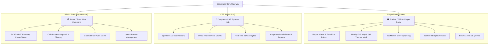

# 🌐 EcoVersee // Zero-Waste Cyber Arena

<div align="center">

```
  ____   ____ ___  _    _ _____ ____  ____  _____ _____ 
 |  _ \ / ___/ _ \| |  | | ____|  _ \/ ___|| ____| ____|
 | |_) | |  | | | | |  | |  _| | |_) \___ \|  _| |  _|  
 |  __/| |__| |_| | |__| | |___|  _ < ___) | |___| |___ 
 |_|    \____\___/ \____/|_____|_| \_\____/|_____|_____|
                                                        
     ◯ △ □  S U R V I V A L   E C O S Y S T E M  ◯ △ □
```

### **The Gamified Smart Campus & Urban Zero-Waste Circular Economy Platform**
*Turning everyday ecological contributions into verified impact, corporate CSR funding, B2B industrial recycling, and Web3 rewards.*

---

[](https://nextjs.org/)
[](https://react.dev/)
[](https://www.typescriptlang.org/)
[](https://tailwindcss.com/)
[](https://docs.ethers.org/)
[](https://missionlife-moefcc.nic.in/)
[](https://opensource.org/licenses/MIT)

[Explore Features](#-core-features--modules) • [Live Portals](#-role-based-architecture) • [Getting Started](#-getting-started) • [Tech Stack](#%EF%B8%8F-technology-stack) • [Web3 Setup](#-web3--metamask-integration) • [Roadmap](#-future-roadmap)

---

</div>

## 📌 Executive Summary

**EcoVersee** is a next-generation, cyberpunk-gamified sustainability super-app designed for modern smart campuses, urban districts, and forward-thinking enterprises. Combining a high-energy **Squid-Game-inspired aesthetic** with rigorous **circular economy workflows**, EcoVersee transforms routine waste disposal and sustainability actions into competitive, incentivized missions.

By bridging the gap between **Student/Citizen Players**, **Corporate CSR Sponsors**, and **Municipal/Campus Administrators**, EcoVersee creates a closed-loop ecosystem for:
- ♻️ **AI-Powered Waste Audits & Marketplace**: Instant visual sorting, material valuation, and B2B scrap matching.
- 🍲 **EcoFood Surplus Network**: Hyperlocal food rescue connecting restaurants with NGOs and budget-conscious students.
- 🏢 **CSR Corporate Funding Arena**: Real-time ESG capital allocation with transparent ROI and community impact proof.
- 📊 **Smart City / Campus IoT Telemetry**: Live energy grid, water consumption, and landfill diversion analytics.
- 🔗 **Verifiable Web3 Eco-Points**: MetaMask integration enabling on-chain proof of environmental stewardship.

---

## 🏛️ Role-Based Architecture

EcoVersee is structured into three dedicated, role-tailored control centers:



### 1. 🎓 Player Portal (`/user`)
*Designed for students, residents, and environmental advocates.*
- **Mission Control**: Daily sustainability quests, personal carbon footprint tracker ($CO_2$ saved, waste diverted).
- **Gamified Progression**: Advance from *Rookie Contestant (#456)* to *Grandmaster Guardian* with dynamic level-ups.
- **Redemption Hub**: Convert earned Eco Points into actual discount vouchers at partner cafés, stores, and mobility hubs.

### 2. 🏢 Corporate CSR Arena (`/csr`)
*Designed for CSR heads, ESG investors, and sustainability sponsors.*
- **Campaign Sponsorship**: Sponsor high-impact campus and city clean-up missions with milestone-based prize pools.
- **Micro-Grant Allocation**: Fund grassroots student upcycling projects with transparent itemized budget breakdowns.
- **ESG Audit Trail**: Export verifiable sustainability reports aligned with global reporting standards.

### 3. 🏛️ Organization Command Center (`/organization`)
*Designed for campus facilities, municipal authorities, and system administrators.*
- **IoT Telemetry Grid**: Monitor live power draw, water leakage anomalies, and campus waste bin capacity.
- **Civic Incident Escalation**: Route citizen-reported illegal dumping and utility issues to dispatch teams.
- **Data Lifecycle Management**: Real-time moderation, material flow oversight, and operational analytics.

---

## ✨ Core Features & Modules

### 📸 1. AI Waste Scanner & Report System
- **Intelligent Material Recognition**: Identifies plastics, e-waste, copper, glass, cardboard, and organics from photo submissions.
- **Instant Geo-Tagging & Routing**: Auto-detects closest smart collection bin and calculates routing distance.
- **Instant Bounty Allocation**: Calculates and credits Eco-Points based on material weight, hazard level, and purity.

### 🗺️ 2. Interactive GIS Nearby Map & Rewards Vault
- **Leaflet-Powered Exploration**: Live geospatial map rendering verified eco-partners, zero-waste stores, and recycling kiosks.
- **Dynamic Filtering**: Filter between Cafés, Refill Stations, E-Waste Drop-Offs, and Food Rescue Hubs.
- **QR Code Voucher Generator**: Instant one-time cryptographically hashed QR codes for offline merchant point-of-sale redemption.

### 🔄 3. Circular Economy & B2B Match Matrix
- **EcoMarket C2C & B2C**: Buy and sell reusable electronics, scrap components, upcycled furniture, and raw recyclables.
- **Industry Demand Board**: Real-time procurement board where manufacturing partners list material bounties (e.g., bulk copper wire, PET plastics) with match-scoring algorithms.
- **Build-From-Waste Blueprints**: Open-source DIY guides turning discarded materials into functional hardware, planters, and solar components.
- **Guild Projects**: Crowdsource discarded components for collaborative campus green engineering builds.

### 🍱 4. EcoFood Surplus Rescue Network
- **50%+ Off Surplus Meals**: Partner restaurants and bakeries list short-dated fresh food to prevent landfill spoilage.
- **NGO Direct Dispatch**: Direct bridge enabling NGOs and shelters to claim bulk donations for immediate pickup.
- **Restaurant Partner Portal**: Merchant console for inventory turnover tracking and food loss mitigation analytics.

### 🤖 5. Front Man AI Copilot
- **Conversational Eco-Consultant**: Context-aware AI handler answering queries on recycling regulations, material valuations, campus telemetry, and upcycling ideas.
- **Prompt Presets**: Instant analysis of campus baselines, pricing estimates for scrap metals, and customized DIY project suggestions.
- **Meme Culture Easter Eggs**: Interactive UI accents with responsive AI status badges.

### ⚡ 6. Smart Campus & City Telemetry (IoT Analytics)
- **Energy Grid Monitor**: Real-time kW consumption trends with anomaly spike detection across campus blocks and halls.
- **Water Network Monitor**: Acoustic and pressure sensor simulations pinpointing subterranean pipe leaks in real-time.
- **Waste Composition Matrix**: Landfill vs. Recycled vs. Reused tonnage tracking rendered with Recharts data visualizers.

### 🏆 7. Survival Arena & Leaderboards
- **Weekly Survival Challenges**: Competitive zero-waste hackathons with dynamic sponsor-funded prize pools.
- **Tiered Leaderboards**: Filter rankings across Students, Volunteer Brigades, Campus Departments, and Corporate Donors.
- **Daily Quests & Streaks**: Earn bonus XP by completing daily recycling, civic reporting, and social advocacy missions.

### 🦹 8. Shinchan Campus Cleanliness Patrol (Easter Egg Game)
- **Interactive Animated Agent**: Shinchan patrols the campus footer, lifting heavy waste sacks and tossing them into the Eco Hub.
- **Click-to-Cheer Mechanics**: Engaging voice lines and instant mini Eco-Point bonus drops on user interaction.

### 🔗 9. Web3 & MetaMask Wallet Integration
- **EIP-1193 MetaMask Integration**: Connect native Web3 browser wallets for verifiable on-chain identity.
- **1-Click Demo Wallet**: Instant sandbox wallet (`0x71C2...45678`) allowing full testing without installing extensions.
- **On-Chain Ready**: Prepared for Soulbound NFT achievement badges and ERC-20 eco-credit smart contracts.

### 🏛️ 10. Government & Civic Connect (Mission LiFE)
- **Civic Issue Dispatch**: Public reporting tool for open dumping, hazardous sewage, and municipal hazards with tracking IDs.
- **Policy Alignment**: Integration with Central Pollution Control Board (CPCB) and India's Mission LiFE environmental frameworks.

---

## 🛠️ Technology Stack

| Layer | Technologies |
|---|---|
| **Frontend Framework** | [Next.js 16.3.2](https://nextjs.org/) (App Router, Server & Client Components) |
| **UI Library** | [React 19.2.8](https://react.dev/) |
| **Language** | [TypeScript 5](https://www.typescriptlang.org/) (Strict mode, Full Type Safety) |
| **Styling & Theme** | [Tailwind CSS v4](https://tailwindcss.com/), Custom Squid Cyberpunk Design System |
| **Animations** | [Framer Motion 12](https://www.framer.com/motion/), CSS Glassmorphism, Dynamic HUD Overlays |
| **Icons & Typography** | [Lucide React](https://lucide.dev/), Geist Sans & Mono Fonts |
| **Data Visualization** | [Recharts 3.10](https://recharts.org/) (Area, Bar, Pie, Responsive Containers) |
| **Geospatial & Maps** | [Leaflet 1.9](https://leafletjs.com/) with React integration & custom SVG markers |
| **Web3 & Blockchain** | [Ethers.js v6.17](https://docs.ethers.org/) (BrowserProvider, AccountsChanged listeners) |
| **State Management** | React Context API with LocalStorage Persistence (`EcoContext`, `Web3Context`) |

---

## 🚀 Getting Started

Follow these steps to set up and run EcoVersee locally on your machine.

### Prerequisites
- **Node.js**: `v18.18.0` or higher (Node.js 20+ LTS recommended)
- **Package Manager**: `npm`, `yarn`, `pnpm`, or `bun`
- **Browser**: Modern Chromium/Firefox browser (MetaMask extension optional for Web3)

### Installation

1. **Clone the repository:**
   ```bash
   git clone https://github.com/parimeena404/prototype-EcoVersee.git
   cd prototype-EcoVersee
   ```

2. **Install dependencies:**
   ```bash
   npm install
   ```

3. **Start the development server:**
   ```bash
   npm run dev
   ```

4. **Launch the application:**
   Open your browser and navigate to:
   ```
   http://localhost:3000
   ```

---

## 🔐 Demo Authentication & Quick Login

EcoVersee includes an interactive Auth Gateway. You can create a new account or test the platform instantly:

| Role | Default Email / Role Selection | Primary Landing Route | Accessible Capabilities |
|---|---|---|---|
| **Student Player** | Select `Student Player` tab | `/user` | Waste reporting, Nearby map, Rewards, Marketplace, Feed, Challenges |
| **Corporate Sponsor** | Select `CSR Corporate` tab | `/csr` | CSR Hub, Mission funding, Project discovery, ESG Reports, CSR Leaderboard |
| **Apex Administrator** | Select `Admin` | `/organization` | IoT Telemetry, Cleanup dispatch, Material flows, User directory |

> **Tip:** You can switch roles at any time from the bottom panel of the Sidebar navigation without re-logging!

---

## 🦊 Web3 & MetaMask Integration

EcoVersee features first-class Web3 integration powered by `ethers.js`:

1. **Connect Native Wallet**: Click the **"Connect MetaMask"** button in the top navigation bar. If MetaMask is installed, it will prompt for account connection.
2. **Instant Demo Mode**: If you don't have MetaMask installed, simply click **"Connect Demo Wallet"** to instantly test Web3-gated features with a pre-configured Ethereum address (`0x71C2a84942C0731a66e22F0fb456e45600E45678`).
3. **Reactive Listeners**: The application automatically detects and responds to account switching (`accountsChanged`) and network switching (`chainChanged`).

---

## 📁 Repository Structure

```
prototype-EcoVersee/
├── public/                     # Static assets, backgrounds, images & memes
│   ├── images/
│   │   └── squid-game/         # Squid Game themed graphics & illustrations
│   └── cyber-hacker-bg.jpg     # Ambient background artwork
├── src/
│   ├── app/                    # Next.js App Router
│   │   ├── [tab]/              # Dynamic route handler
│   │   ├── csr/                # Corporate Impact Portal routes
│   │   ├── organization/       # Administrator / Front Man routes
│   │   ├── user/               # Student Contestant routes
│   │   ├── globals.css         # Cyberpunk design system & glow utilities
│   │   ├── layout.tsx          # Root HTML layout with context providers
│   │   └── page.tsx            # Auth Gate & View Router
│   ├── components/
│   │   ├── ai/                 # Front Man AI Copilot interface
│   │   ├── auth/               # Auth Gate, login/register modals
│   │   ├── game/               # Shinchan Cleanliness Patrol minigame
│   │   ├── layout/             # Sidebar, Header, HUD background & Routers
│   │   ├── map/                # Leaflet Campus & City GIS Map
│   │   └── views/              # 35+ Dedicated view components
│   │       ├── csr/            # CSR Hub, Missions, Funding & Reports
│   │       ├── AdminSuiteView.tsx
│   │       ├── CampusMonitorView.tsx
│   │       ├── EcoMarketView.tsx
│   │       ├── EcoFoodView.tsx
│   │       ├── LeaderboardView.tsx
│   │       ├── NearbyView.tsx
│   │       ├── ReportWasteView.tsx
│   │       └── ...
│   ├── context/                # Global Application State
│   │   ├── EcoContext.tsx      # Comprehensive domain state & mutations
│   │   └── Web3Context.tsx     # Ethers.js MetaMask wallet provider
│   ├── data/
│   │   └── mockData.ts         # Rich mock datasets for offline resilience
│   └── types/
│       └── index.ts            # TypeScript interfaces & domain models
├── package.json
├── tsconfig.json
└── next.config.ts
```

---

## 📜 Available Scripts

In the project root directory, you can run:

| Command | Action |
|---|---|
| `npm run dev` | Runs the app in development mode on `http://localhost:3000` with hot-reloading |
| `npm run build` | Compiles the production-optimized Next.js bundle |
| `npm run start` | Starts the production server after building |
| `npm run lint` | Runs ESLint 9 checks to ensure code quality |

---

## 🗺️ Future Roadmap

- [ ] **On-Device Edge AI Vision**: Real-time object recognition using TensorFlow.js in the browser for instant camera-based waste sorting.
- [ ] **Smart Contracts on Polygon / Arbitrum**: Deploy ERC-20 `$ECO` utility tokens and ERC-1155 verifiable carbon offset certificates.
- [ ] **Hardware IoT LoRaWAN Integrations**: Connect real-world ultrasonic bin level sensors and LoRaWAN gateways to the live telemetry dashboard.
- [ ] **Mobile Progressive Web App (PWA)**: Full offline-first support with background GPS geolocation sync for field waste reporting.
- [ ] **Municipal Open Data APIs**: Bi-directional integration with Indian Smart Cities Mission & municipal solid waste fleet trackers.

---

## 🤝 Contributing

Contributions make the open-source community an incredible place to learn, inspire, and create! Any contributions to **EcoVersee** are **greatly appreciated**.

1. **Fork the Project**
2. **Create your Feature Branch**:
   ```bash
   git checkout -b feature/AmazingFeature
   ```
3. **Commit your Changes**:
   ```bash
   git commit -m 'feat: Add some AmazingFeature'
   ```
4. **Push to the Branch**:
   ```bash
   git push origin feature/AmazingFeature
   ```
5. **Open a Pull Request**

---

## 📄 License

Distributed under the **MIT License**. See `LICENSE` for more information.

---

<div align="center">

**Built with ❤️ for a Greener, Zero-Waste Tomorrow**  
*◯ △ □ Play for the Planet. Survive for the Future. ◯ △ □*

</div>
